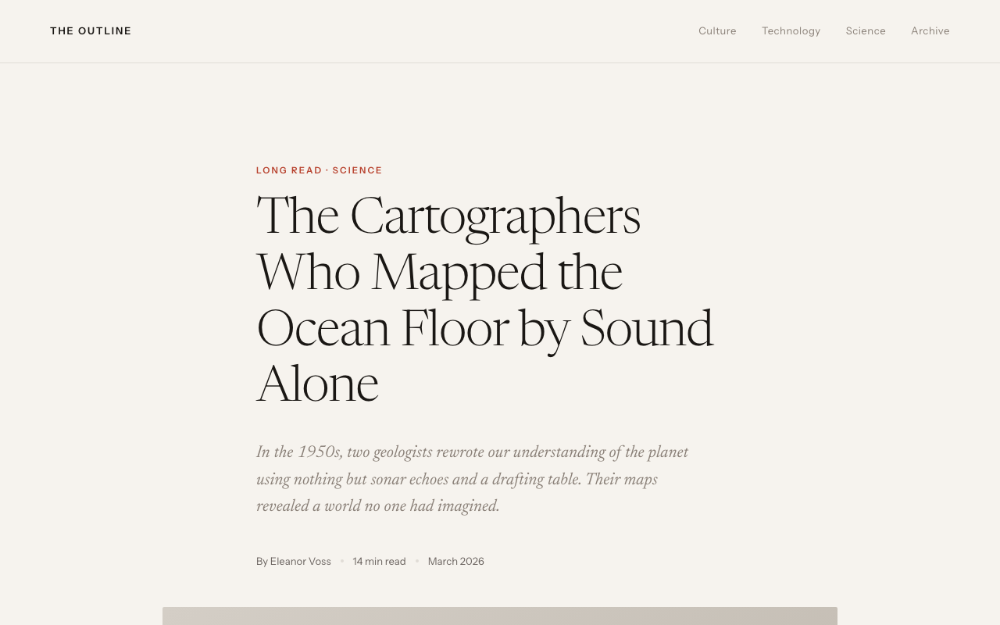
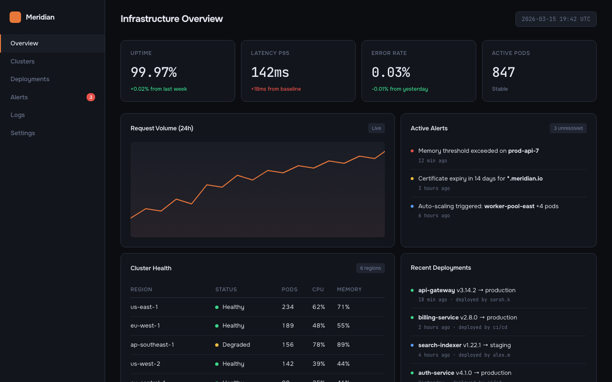
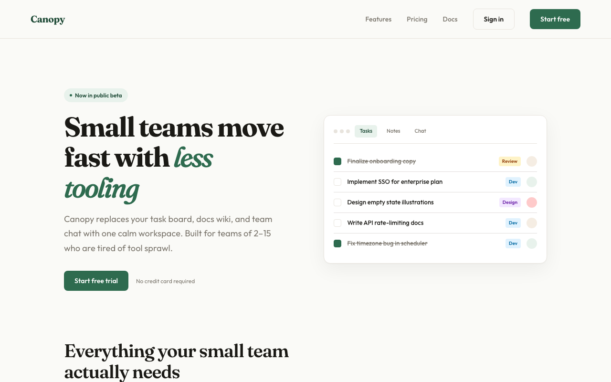

# variant-design

English | **[中文](./README_CN.md)**

> Solve the blank canvas problem. Prompt → 3 fully-formed distinct designs → vary → export.

A Claude Code skill inspired by the [Variant](https://variant.com) design community, powered by the **Impeccable design system**. Give it a prompt, get three divergent design directions — each from a different studio's aesthetic — then iterate with one-word actions.

---

## Sample output

Three variations from a single prompt — each feels like a different studio:

| A — Editorial | B — Dark Dashboard | C — SaaS Landing |
|---|---|---|
|  |  |  |

---

## What it does

### Generate Mode (default)

1. **Detects your scenario** — dashboard, SaaS landing page, editorial, e-commerce, mobile app, creative tool, education, portfolio, food & beverage, fashion & lifestyle
2. **Loads design system references** — typography, color theory (OKLCH), spatial design, motion, micro-interactions, interaction, responsive, UX writing
3. **Generates 3 distinct variations** — each pulls from a different aesthetic direction with full interactivity (scroll reveals, animated charts, hover effects, functional JS)
4. **Runs an AI Slop Test** — quality gate that catches generic AI aesthetic fingerprints before presenting
5. **Ships working code** — Context-aware output: auto-detects React projects and generates `.tsx` components; generates zero-dependency interactive HTML otherwise. Real content, no lorem ipsum
6. **Offers variation actions** — push further, polish, critique, swap styles, remix colors, shuffle layouts, add motion, dramatize, make interactive

### UX Review Mode

Comprehensive usability evaluation grounded in Nielsen Norman Group research — 13 specialized reference libraries covering everything from heuristics to conversion design.

1. **Heuristic evaluation** — Walk flows against Nielsen's 10 heuristics; each violation rated by severity (1=cosmetic to 4=critical)
2. **Cognitive load analysis** — Identify sources of extraneous complexity; suggest reduction strategies
3. **Mental model diagnosis** — Find mismatches between what users expect and what the system does
4. **Affordance audit** — Flag elements that look interactive but aren't (or vice versa)
5. **Gestalt check** — Verify proximity, similarity, and grouping signals match intended relationships
6. **Dark pattern scan** — Identify manipulative patterns (confirmshaming, roach motel, hidden costs)
7. **Information architecture** — Navigation labels, hierarchy depth, search design, card sort validation
8. **Accessibility audit** — WCAG 2.1 AA, keyboard navigation, ARIA patterns, color contrast
9. **Mobile interaction** — Touch targets, thumb zones, gesture conflicts, iOS vs Android conventions
10. **Onboarding review** — First-use experience, Aha moment path, empty states, activation funnel
11. **Data visualization** — Chart type selection, color encoding, dashboard information density
12. **Design token review** — Token tier architecture, naming conventions, theming and dark mode
13. **Conversion design** — Trust signals, CTA copy, pricing page structure, form friction points

```
ux review              → Full heuristic evaluation of current design
review this design     → Walk flows, flag violations with severity ratings
cognitive load         → Identify what's making this feel complex
mental models          → Diagnose why users get confused here
affordances            → Does this look clickable / draggable / interactive?
dark patterns          → Ethical audit of interaction patterns
navigation             → Information architecture and navigation usability
accessibility / a11y   → WCAG compliance and inclusive design audit
mobile gestures        → Mobile interaction conventions audit
onboarding             → First-use experience and activation flow review
chart / data viz       → Data visualization selection and design audit
design tokens          → Token architecture and theming review
conversion / CTA       → Conversion design and trust signal audit
design critique        → How to give and receive effective design feedback
user research          → How to plan usability tests and research methods
```

### Analyze Mode (existing sites)

1. **Scans your existing code** — reads HTML, CSS, JSX, Vue, Svelte files for design tokens
2. **Extracts design primitives** — colors, fonts, spacing, components, transitions, breakpoints
3. **Detects inconsistencies** — near-duplicate colors, off-grid spacing, missing hover states, contrast failures, font scale issues
4. **Generates a style report** — scored audit with severity levels and priority fix list
5. **Produces tokens** — consolidated CSS custom properties file from scattered hardcoded values
6. **Generates style-matched pages** — new pages that follow your existing design system exactly
7. **Creates migration plans** — phased checklist for consolidating an inconsistent codebase

```
audit                    → Full style consistency report
tokens                   → Extract tokens from existing CSS
match                    → Generate new pages matching your existing style
new page pricing         → Add /pricing page following your current design
migrate                  → Phased plan to consolidate design tokens
compare old new          → Side-by-side existing vs. redesigned
```

---

## Installation

### Claude Code (recommended)

```bash
claude skill install https://github.com/YuqingNicole/variant-design-skill
```

Or add manually to your project's `SKILL.md` — copy the contents of [`SKILL.md`](./SKILL.md) into your existing skill file.

### Hermes Agent (Nous Research)

[Hermes Agent](https://github.com/nousresearch/hermes-agent) is a self-improving AI agent framework that supports 200+ models and persists skills across sessions.

**Install Hermes:**
```bash
# Linux / macOS / WSL2
curl -fsSL https://raw.githubusercontent.com/NousResearch/hermes-agent/main/scripts/install.sh | bash

# Windows (PowerShell)
iex (irm https://raw.githubusercontent.com/NousResearch/hermes-agent/main/scripts/install.ps1)
```

**Load this skill into Hermes:**
```bash
# 1. Start Hermes
hermes

# 2. Point it at this skill file — paste SKILL.md contents into your workspace's AGENTS.md
#    (~/.hermes/workspace/AGENTS.md  or the project-level equivalent)
cat SKILL.md >> ~/.hermes/workspace/AGENTS.md

# 3. Select your model
hermes model   # choose any provider (Anthropic, OpenAI, OpenRouter, etc.)

# 4. Start designing
hermes
> design a SaaS landing page with 3 variations
```

Hermes persists skills in its skill registry — once loaded, variant-design is available in every subsequent session without re-loading.

### OpenClaw

[OpenClaw](https://github.com/openclaw/openclaw) is a local-first AI assistant gateway that connects 40+ messaging platforms (WhatsApp, Telegram, Slack, Discord, iMessage, etc.) to AI agents.

**Install OpenClaw:**
```bash
npm install -g openclaw@latest
openclaw onboard --install-daemon
```

**Load this skill into OpenClaw:**
```bash
# 1. Copy SKILL.md contents into your OpenClaw workspace AGENTS.md
cat SKILL.md >> ~/.openclaw/workspace/AGENTS.md

# 2. Set your model in ~/.openclaw/openclaw.json
{
  "agent": {
    "model": "anthropic/claude-sonnet-4-6"
  }
}

# 3. Start the gateway
openclaw onboard --install-daemon

# 4. Use via any connected channel (Telegram, Slack, iMessage, etc.)
> design a dashboard with 3 variations
> ux review
> vary strong A
```

**In-session commands (any channel):**
```
/new             → start a new design session
/think high      → enable extended thinking for complex design decisions
/reset           → clear context and start fresh
```

OpenClaw routes your design requests through the connected channel directly to the agent — you can trigger `vary strong A`, `remix colors`, or `ux review` from Telegram or iMessage the same way you would in a terminal.

### Other Claude interfaces

**Claude.ai (web/desktop):** Paste the contents of `SKILL.md` into a Project's custom instructions, or drop it at the top of a conversation as a system prompt.

**API / custom integrations:** Include `SKILL.md` as a system message before your user turn.

---

## Usage

### Basic triggers

The simplest way — just describe what you want:

```
design a dashboard for a crypto trading terminal
show me 3 directions for a SaaS landing page
give me UI options for a wellness app
```

### Directed triggers — lock in a style or reference a site

You can be more specific by naming an aesthetic direction, a palette, or even an existing site you want to match:

```
developer tools homepage, code-first hero with CLI snippet, dark Data/Technical direction

landing page for an AI agent tool — Dark Indigo palette, Geist font, Code-First layout from saas.md

3 variations for a food delivery app — one Warm/Human, one Bold/Expressive, one Neo-brutalist

reproduce the visual style of [site you described] — dark navy, monospace, swim lane diagrams
```

**Tip:** the more constraints you name (direction + palette + layout pattern), the more targeted the output. The more open the prompt, the more divergent the three variations will be.

### Anatomy of a directed prompt

```
[what it is] + [domain] + [aesthetic direction or palette] + [layout hint] + [any signature detail]
```

Examples:

| Goal | Prompt |
|---|---|
| Match a specific site's vibe | `"developer tool landing page — dark Data/Technical, CLI code hero, Dark Indigo palette"` |
| Explore freely | `"landing page for a mindfulness app"` |
| One fixed + two free | `"3 directions for a finance dashboard — one must be Amber Finance dark terminal"` |
| Multi-screen flow | `"3-screen onboarding flow for a meditation app, Wellness Soft palette"` |

### Variation actions

After seeing the initial 3 variations, iterate with:

| Action | What happens |
|---|---|
| **Vary strong** | Push current direction to its extreme |
| **Vary subtle** | Polish and refine, same aesthetic |
| **Distill** | Strip to essence — remove everything non-essential |
| **Change style** | Keep layout, swap entire visual language |
| **Remix colors** | 3 alternative palettes using OKLCH: analogous / complementary / unexpected |
| **Shuffle layout** | Same content + style, different composition |
| **Add motion** | Layer micro-interactions and animations onto current design |
| **Dramatize** | Push interactions to cinematic maximum (parallax, 3D tilt, curtain reveal) |
| **Make interactive** | Add functional patterns: filtering, charts, drag-and-drop, form validation |
| **Polish** | Refine against design system: typography, spacing, interactions, motion, copy |
| **Critique** | Systematic audit against all 8 design system dimensions |
| **Extract tokens** | Export design tokens as CSS / JSON / Tailwind config |
| **See other views** | Mobile / dark mode / empty state / onboarding / hover states |
| **Mix** | Combine two variations: "Mix A + B" or "A's layout + C's colors" |

### Quick iteration shorthand

In Claude Code you can use shorthand for fast iteration:

```
A vary strong          → Push Variation A to maximum
B remix colors         → 3 new palettes for Variation B
C → mobile             → Show C as mobile viewport
pick A                 → Select A as winner
A + B colors           → Mix A layout with B palette
tokens A               → Extract CSS tokens from A
compare                → Side-by-side view of all 3
open B                 → Re-open B in browser
react A                → Export Variation A as React .tsx component
react B                → Export Variation B as React .tsx component
show context           → Print current persisted palette/fonts/direction
reset context          → Clear context, start fresh next session
```

### What you'll see

Files are written to `variant-output/` and **auto-opened in your browser** — you never need to manually find or open files. Each variation comes with a compact **Summary Card** in the terminal (direction, palette, fonts, interactions). Actions are grouped into **Reshape / Tune / Animate / Refine / Export** categories.

On iteration, the same file is overwritten and re-opened — your browser tab refreshes automatically. The terminal shows a 2-3 line summary of what changed, not the full code.

**Context persists across sessions.** When you re-enter a project directory, the skill reads `variant-output/.variant-context.json` and resumes your last palette, fonts, direction, and iteration count automatically:

```
✦ Resuming context: Amber Warm · Editorial · Instrument Serif + Instrument Sans · picked B · 4 iterations
  (reset context to start fresh)
```

No need to re-specify preferences you've already confirmed. Use `show context` to inspect the current context, or `reset context` to start fresh.

**Output format** is context-aware: if your current directory contains a React project (`package.json` with `react` dependency), output is `.tsx` components. Otherwise, zero-dependency HTML is the default. Override with `--react` or `--html`. See below for more.

### React output (context-aware)

In a React project, the skill automatically switches to `.tsx` output:

```
# In a React/Next/Vite project directory:
design a dashboard  →  generates variant-output/VariantA.tsx, VariantB.tsx, VariantC.tsx
                        Detects Next.js → adds "use client" where needed
                        Detects framer-motion → uses it; otherwise CSS animations

# In any other directory:
design a dashboard  →  generates variant-output/variant-dashboard-A.html (unchanged)

# Explicit override anywhere:
design a dashboard --react   →  always .tsx
design a dashboard --html    →  always HTML

# Export a specific variation:
react A              →  export Variation A as .tsx
export to next       →  export winning variation as Next.js App Router component
```

Generated `.tsx` files go to `variant-output/` — move them to `src/components/` to include in your project's build. The preview command is inferred from your `package.json` scripts (`npm run dev`, `pnpm dev`, etc.).

---

## Reference library

### Domain references
Scenario-specific materials (starter prompts, palettes, typography, layouts, real community examples):

| File | Domain |
|---|---|
| `references/dashboard.md` | Data dashboards, analytics, monitoring, trading terminals |
| `references/editorial.md` | Magazines, journalism, long-form, news |
| `references/saas.md` | SaaS landing pages, B2B, developer tools |
| `references/ecommerce.md` | E-commerce, consumer apps, fintech cards |
| `references/education.md` | Learning apps, quizzes, language tools |
| `references/creative.md` | Generative art, music tools, creative software |
| `references/mobile.md` | iOS/Android apps, onboarding, home screens |
| `references/portfolio.md` | Designer portfolios, developer showcases, freelancer sites |
| `references/food-beverage.md` | Restaurants, recipes, coffee brands, bakeries, cocktail bars |
| `references/fashion.md` | Fashion brands, streetwear, beauty, interior design, lifestyle |
| `references/palettes.md` | Universal palette library — 39 palettes × 7+ aesthetic directions (incl. Pinterest trends) |
| `references/interactive-patterns.md` | Filtering, drag-and-drop, charts, lightbox, carousels, multi-step forms |
| `references/ux-heuristics.md` | Nielsen's 10 heuristics · Fitts's Law · Hick's Law · Jakob's Law · severity ratings · evaluation protocol |
| `references/ux-psychology.md` | Mental models · cognitive load · Gestalt principles · reading patterns · affordances · attention · memory · trust |
| `references/ux-information-architecture.md` | Navigation patterns · information scent · card sorting · tree testing · labeling rules · search design · IA anti-patterns |
| `references/ux-accessibility.md` | WCAG 2.1 AA · keyboard navigation · semantic HTML · ARIA usage · color contrast · accessible forms · a11y code scans |
| `references/ux-research-methods.md` | Usability testing · user interviews · SUS/NPS · A/B testing · analytics · research method selection matrix |
| `references/ux-mobile-patterns.md` | Touch targets · thumb zones · gesture conventions · iOS vs Android · bottom gesture conflicts · mobile forms |
| `references/ux-onboarding.md` | Aha moment · empty states · progressive disclosure · signup flow · activation funnel · onboarding anti-patterns |
| `references/ux-data-visualization.md` | Chart selection · visual encoding hierarchy · dashboard density · color encoding · interactive patterns · data anti-patterns |
| `references/ux-content-strategy.md` | Content models · taxonomy · multilingual UX · RTL layouts · content lifecycle · multi-surface design |
| `references/ux-design-tokens.md` | Three-tier token architecture · naming conventions · semantic tokens · multi-brand theming · dark mode · Style Dictionary |
| `references/ux-component-specs.md` | Button/input/modal/toggle full state machines · spacing specs · ARIA patterns · keyboard interaction |
| `references/ux-design-critique.md` | Feedback frameworks · taste trap · HiPPO problem · async review · critique vs review · self-critique checklist |
| `references/ux-conversion-patterns.md` | Trust signals · landing page anatomy · CTA copy · pricing page patterns · form conversion · dark pattern identification |

### Design system references (Impeccable)
Foundational design principles loaded for every generation:

| File | Covers |
|---|---|
| `references/design-system/typography.md` | Modular scale, fluid type, font pairing, OpenType features, vertical rhythm |
| `references/design-system/color-and-contrast.md` | OKLCH color space, tinted neutrals, 60-30-10 rule, dark mode, WCAG contrast |
| `references/design-system/spatial-design.md` | 4pt grid, container queries, squint test, hierarchy through multiple dimensions |
| `references/design-system/motion-design.md` | 100/300/500 rule, ease-out-expo, stagger, reduced motion, perceived performance |
| `references/design-system/interaction-design.md` | 8 interactive states, focus-visible, forms, modals, keyboard navigation |
| `references/design-system/responsive-design.md` | Mobile-first, content-driven breakpoints, input detection, safe areas |
| `references/design-system/ux-writing.md` | Button labels, error formulas, empty states, voice vs tone, accessibility |
| `references/design-system/micro-interactions.md` | Scroll reveals, hover effects, counters, parallax, page transitions, toasts |
| `references/design-system/style-audit.md` | Token extraction, consistency detection, audit reports, migration plans |

---

## Design principles

- **Real content wins.** Plausible headlines, real data, actual copy. Makes designs feel alive.
- **Commit fully.** Half-executed aesthetics look worse than simple ones.
- **Never converge.** If A is dark, B cannot also be dark. Each must feel like a different studio.
- **Typography first.** Distinctive display font + reliable body. Never Inter, Roboto, Arial, system-ui.
- **Color = one bold OKLCH choice.** One dominant color used with conviction beats five timid colors. Always tint neutrals.
- **No AI slop.** No purple gradients, no glassmorphism, no bounce easing, no centered-everything layouts.

---

## Contributing

PRs welcome. Each domain reference file follows a consistent 6-section schema:

1. Starter Prompts (domain-grouped)
2. Color Palettes (CSS custom properties)
3. Typography Pairings
4. Layout Patterns
5. Signature Details
6. Real Community Examples

Design system references follow the Impeccable style structure with principles, code examples, and anti-patterns.

---

## Examples

The `examples/` directory contains runnable demos:

| File | What it demonstrates |
|---|---|
| `examples/coffee-brand-interactive.html` | Full interactive landing page: curtain reveal, staggered entrance, scroll reveals, animated counters, product filter, card hover lift, image zoom, SVG donut chart, flavor bar animation, toast notifications, mobile hamburger menu, back-to-top, reduced motion fallbacks |

Open any example directly in your browser to see the interactions in action.

---

Built with [Claude Code Skills](https://claude.ai/code). Design system powered by [Impeccable](https://github.com/tychografie/impeccable).
